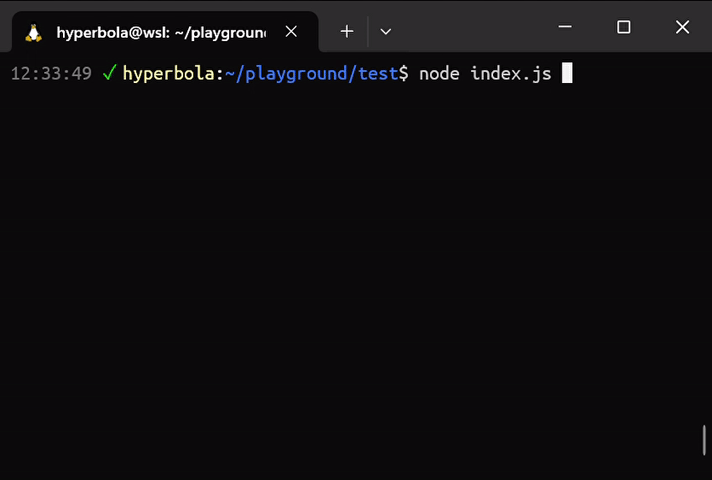

# PooPooBar

A cool CLI progress bar.



- Simple: easy to use.
- Lightweight: very few dependencies.
- Informative: instant and precise progress, ETA, and speed
- Smart: silent on non-tty.
- TypeScript supported.
- CommonJS/ESM supported.

## Installation

```sh
npm install poopoobar
```

## Usage

A simple example:

```js
import ProgressBar from 'poopoobar' // ESM
const ProgressBar = require('poopoobar') // commonjs

const bar = new ProgressBar(100)
bar.start()

for (let i=0; i<100; i++) {
  do_task()
  bar.tick()
}
bar.stop()
```

Another example:

```js
import ProgressBar from 'poopoobar' // ESM
const ProgressBar = require('poopoobar') // commonjs

const bar = new ProgressBar(100, { clearAfterStop: true, width: 80 })
bar.start()

try {
  for (let i=0; i<100; i+=2) {
    bar.log('Start task %d and %d', i, i+1)
    do_two_tasks()
    bar.tick(2)
    bar.log('Task %d and %d finished', i, i+1)
  }
} finally {
  bar.stop()
}
```

## API

- **`class ProgressBar`**

  | Property | Type | Description |
  | -------- | ---- | ----------- |
  | `progress` | `number` | current progress value; guaranteed to be a non-negative integer |
  | `total` | `number` | total progress value; guaranteed to be a positive integer |

- **`ProgressBar(total: number, options?: object)`**

  Creates a progress bar instance.

  | Argument | Type | Description |
  | -------- | ---- | ----------- |
  | `total`  | `number` | total progress; must be a positive integer |
  | `options?` | `object` | progress bar options; default to all default options |
  | `options.width?` | `number` | progress bar width; must be at least 16; default to terminal column count |
  | `options.output?` | [`tty.WriteStream`](https://nodejs.org/api/tty.html#class-ttywritestream) | output stream; default to [`process.stderr`](https://nodejs.org/api/process.html#processstderr) |
  | `options.clearAfterStop?` | `boolean` |  clear the bar after stopping; default to `false` |

  You probably don't want to use two progress bars simultaneously,
  as this can break the drawing.

- **`progressBar.start()`**

  Start the progress bar. By this time the progress bar is drawn on the terminal and is refreshed
  periodically. This cannot be called twice.

- **`progressBar.tick(value?: number)`**

  Increase the progress bar `value`. The new progress must not exceed `total`. This must be called
  only after `start()`.

   | Argument | Type | Description |
   | -------- | ---- | ----------- |
   | `value?`  | `number` | progress increment value; default to `1` |

- **`progressBar.stop()`**

  Stop the progress bar. This clears the bar on the terminal if `options.clearAfterStop` is set to
  `true`. This must be called after `start()`. This acts as a no-op if called more than once.

  You cannot restart a progress bar after stopping. Use a new progress bar instance in this case.

- **`progressBar.log(format: string, ...arguments: any[])`**

  Print a message. If the progress bar is not running or if this is a non-tty program, it acts as a
  trivial print.

  | Argument | Type | Description |
  | -------- | ---- | ----------- |
  | `format` | `string` | see [`util.format`](https://nodejs.org/api/util.html#utilformatformat-args) |
  | `...arguments` | `any[]` | see [`util.format`](https://nodejs.org/api/util.html#utilformatformat-args) |

  Do not directly call `process.stderr.write` or `console.error` (or write to the bar stream) when
  the progress bar is running, as it can break the drawing.
